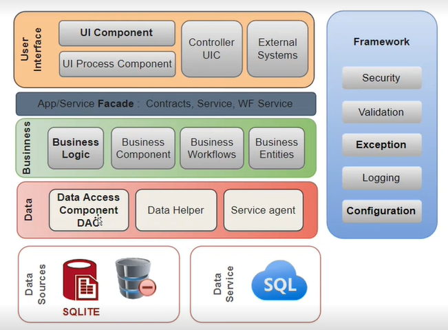
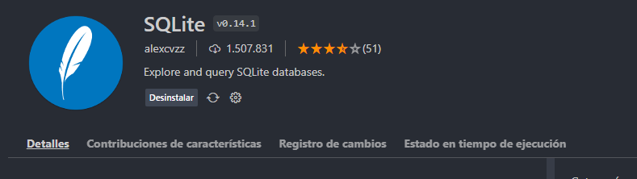

Fecha: 20-01-2023

# Arquitectura N-Tier

+ Segmentacipon para que cada capa tenga una responsibilidad 
+ Arquitectura empresarial que más se utiliza en todos los lenguajes de programación

## Capas

+ ***Framework:*** Se puede absorber en cualquier momento, cualquiera de la otras capas pueden llamar a cualquier elemento que se encuentre dentro de esta capa.
+ ***Data:*** Permite acceder a los datos y solo puede ser invocada por la capa superior(Businness).
+ La capa inferior debe ser invocada por la superior y así sucesivamente hasta salir, no se puede romper ese orden (no se puede saltar de capas).

# Base de datos

+ ***SQLITE:*** Base de datos bastante liviana, no necesita un entorno de ejecución.
  + ***Tipos de datos:***
    + Null
    + Integer
    + Real
    + text
    + Blob: Almacenar videos, información binaria

### Extensión SQLite

Permite ejecutar comandos de SQLlite, permite guardar, crear información en esta base de datos

+ too lo que este en mayuscula es de base de datos
