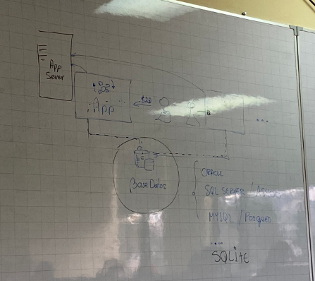
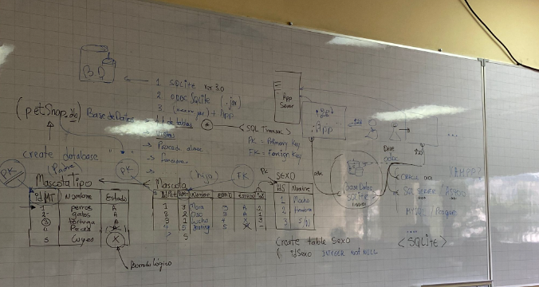
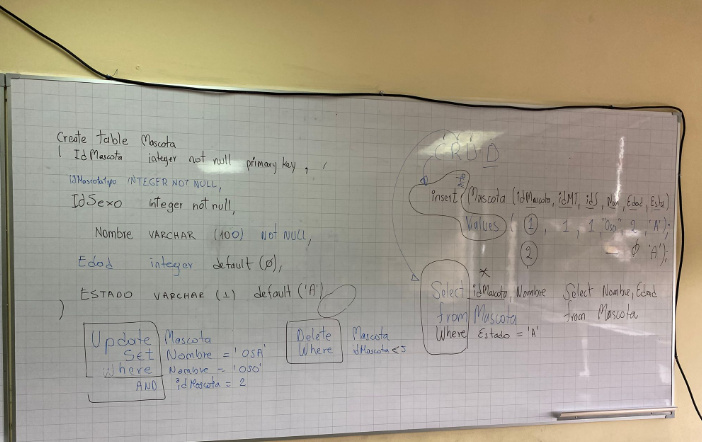
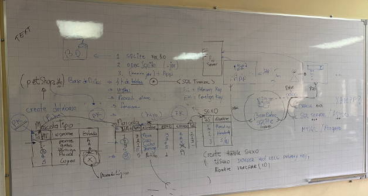

Fecha: 20-01-2023

# Arquitectura N-Tier

+ Segmentacipon para que cada capa tenga una responsibilidad 
+ Arquitectura empresarial que más se utiliza en todos los lenguajes de programación


## Capas

+ ***Framework:*** Se puede absorber en cualquier momento, cualquiera de la otras capas pueden llamar a cualquier elemento que se encuentre dentro de esta capa.
+ ***Data:*** Permite acceder a los datos y solo puede ser invocada por la capa superior(Businness).
+ La capa inferior debe ser invocada por la superior y así sucesivamente hasta salir, no se puede romper ese orden (no se puede saltar de capas).

# Base de datos

+ ***SQLITE:*** Base de datos bastante liviana, no necesita un entorno de ejecución.
  + ***Tipos de datos:***
    + Null
    + Integer
    + Real
    + text
    + Blob: Almacenar videos, información binaria

### Extensión SQLite

Permite ejecutar comandos de SQLlite, permite guardar, crear información en esta base de datos


+ too lo que este en mayuscula es de base de datos

+ **Persistir:** Almacenar datos
+ Guardar en archivos o usar bases de datos.
+ Utilizo bases de datos cuando necesito que varios usuarios necesitan acceder a la misma información.



- Servidor de usuarios y servidor de bases de datos.
- Base de datos es centralizado

### Tipos de bases de datos:

1. Oracle
2. SQL Server / A5400
3. MYSQL / posgred
4. SQLITE **(Es el que vamos a usar)**

+ Los datos se almacenan con un lenguaje propio.
+ Siempre que se tiene una base de datos se debe tener un driver o conector (**odbc**) respectivo para cada tipo de bases de datos.
+ Para <**SQLITE**> se necesita su propio (**odbc**), el cual permite ingresar a la base de datos, extraer e ingresar información.
+ Vamos a usar SQLITE por que es liviana y no existe la necesidad de descargar cosas de internet, y especialmente por su practicidad.

### SQLITE

+ SQLITE versión  3.0
+ ODBC SQLITE (.jar) : Se coloca en la aplicación que vamos a usar.
+ (xxxxx.jar) + App : Es añadir a mi aplicación
    
### Base de datos

Conjunto de **tablas,** vistas, procedimientos de almacenamiento y funciones. Para  base de datos se creo el archivo con extensión <.db>

### SQL Transac

+ Es el núcleo para las bases de datos.
+ Es el mundito de palabras reservadas.



**MascotaTipo**

**MascotaTipo**

**PK:** Primary key

**FK:** Foreign key

+ Se recomienda hacer un borrado lógico para que  no se pierdan los datos históricos.
+ No hacer un borrado físico porque afecta los datos históricos, puesto que si realizo este borrado se borra de toda la base de datos, es como si nunca hubiera existido.
+ La columna estado me permite realizar el borrado lógico.
+ Palabra reservada <**create**>

**Crear tablas**

```sql
create table Sexo
( idSexo INTEGER NOT NULL PRIMARY KEY, 
	Nombre VARCHAR (10) // El limite de caracteres es de 10 y para cuando se coloca TEXT no tiene limite
)
```
+ El truncamiento existe para cuando existen cosas demasiadas extensas.
+ La normalización permite realizar cambios de una manera más rápido.
+ **CRUD: C → Create ; R → Read Select ; U → Update ; D → Delete**

```sql
create table Sexo
( idSexo INTEGER NOT NULL PRIMARY KEY, 
	Nombre VARCHAR (10) // El limite de caracteres es de 10 y para cuando se coloca TEXT no tiene limite
)
```
+ Me llama todas las columnas de la tabla **Mascota**

```sql
Select * idMascota, Nombre
from Mascota
Where Estado = 'A'
```

+ Llama solo las columnas que necesito

```sql
Select Nombre, Edad
from Mascota
```

+ Realizar cambios con **UPDATE**

```sql
Update Mascota
			SET Nombre = 'OSA'
			Where Nombre = 'OSO'
			AND  idMascota = 2 
```

+ Para borrar con **DELETE**

```sql
Delete Mascota 
Where idMascota < 5
```

## Ejemplo




## Código de la base de datos

```sql
/**
*   pat_mic : 20.ene.2k23
*   script de base de datos
CRUD
CREATE  --> Insert
READ    --> leer
UPDATE  --> actu+alziar
DELETE  --> borrar
*/

-- revisar el entorno de trabajo
.version
.database
.show

.tables

DROP TABLE PERSONA;
DROP TABLE MascotaTipo;


CREATE TABLE MascotaTipo
(
    IdMascotaTipo   INTEGER PRIMARY KEY AUTOINCREMENT,
    Nombre          VARCHAR(10) NOT NULL,
    Estado          VARCHAR(1) NOT NULL DEFAULT('A')
);

CREATE TABLE Sexo 
(
    IdSexo INTEGER NOT NULL PRIMARY KEY AUTOINCREMENT,
    Nombre VARCHAR (100);
    --Morales.Anthony
);
// LLENAR TABLA SEXO
INSERT INTO Sexo (N)

CREATE TABLE Mascota
(
    IdMascota       INTEGER PRIMARY KEY AUTOINCREMENT,
    IdMascotaTipo   INTEGER NOT NULL,
    IdSexo          INTEGER NOT NULL,
    Nombre          VARCHAR (100) NOT NULL,
    Edad            INTEGER NOT NULL,
    Estado          I
    
    
     --Jonathan.Luzuriaga
)

CREATE TABLE 

INSERT INTO MascotaTipo ( Nombre, Estado)  VALUES ( "Perros", "A");  
INSERT INTO MascotaTipo ( Nombre)          VALUES ( "Gatos");
INSERT INTO MascotaTipo ( Nombre)          VALUES ( "Peces");
INSERT INTO MascotaTipo ( Nombre)          VALUES ( "Cuyes");
INSERT INTO MascotaTipo ( Nombre)          VALUES ( "Leona");
--DELETE FROM MascotaTipo WHERE IdMascotaTipo > 9;
SELECT * from MascotaTipo;

UPDATE MascotaTipo SET Estado = "X" 
WHERE IdMascotaTipo in (6,12);

SELECT * from MascotaTipo 
WHERE Nombre like '%e%';


-- DROP TABLE T1;
-- DROP TABLE T2;

INSERT INTO PERSONA (ID,    NOMBRE,     APELLIDO)   VALUES  (1, "Pepe ",  "perez");
INSERT INTO PERSONA (ID,    NOMBRE,     APELLIDO)   VALUES  (2, "Ana",  "Suarez");
INSERT INTO PERSONA (ID,    NOMBRE,     APELLIDO)   VALUES  (3, "Juan",  "Sanchez");
INSERT INTO PERSONA (ID,    NOMBRE,     APELLIDO)   VALUES  (4, "Lucas Juan",  "Montalvo");

SELECT ID,    NOMBRE,     APELLIDO FROM PERSONA;

SELECT ID,    NOMBRE,     APELLIDO 
FROM PERSONA
WHERE ID = 2;

SELECT ID,    NOMBRE,     APELLIDO 
FROM PERSONA
WHERE NOMBRE LIKE '%JUAN%';

----------------------------------------------
CREATE TABLE PET
(
    ID          INTEGER PRIMARY KEY,
    NOMBRE      VARCHAR(10),
    EDAD        INTEGER 
);
--DROP TABLE PET;
INSERT INTO PET (ID,    NOMBRE,     EDAD)   VALUES  (1, "VALUMA", 1);
INSERT INTO PET (ID,    NOMBRE,     EDAD)   VALUES  (2, "JUANA",  2);
INSERT INTO PET (ID,    NOMBRE,     EDAD)   VALUES  (3, "COMOTU", 3);
SELECT * FROM PET;
------------------------------------------------
```

```sql
/**
*   pat_mic : 20.ene.2k23
*   script de base de datos
CRUD
CREATE  --> Insert
READ    --> leer
UPDATE  --> actu+alziar
DELETE  --> borrar
*/

-- revisar el entorno de trabajo
.version
.database
.show

.tables

DROP TABLE PERSONA;
DROP TABLE MascotaTipo;


CREATE TABLE MascotaTipo
(
    IdMascotaTipo   INTEGER PRIMARY KEY AUTOINCREMENT,
    Nombre          VARCHAR(10) NOT NULL,
    Estado          VARCHAR(1) NOT NULL DEFAULT('A')
);

CREATE TABLE Sexo 
(
    IdSexo INTEGER  NOT NULL PRIMARY KEY AUTOINCREMENT
    ,Nombre         VARCHAR (100)
    ,Estado         VARCHAR(1) NOT NULL DEFAULT('A')
);

-- JOSUE PERALTA LLENE TABLA SEXO
INSERT INTO Sexo (NOMBRE) VALUES ("HEMBRA");
INSERT INTO Sexo (NOMBRE) VALUES ("MACHO");
INSERT INTO Sexo (NOMBRE) VALUES ("SIN SEXO");
select * from sexo;
--Jonathan Luzuriaga :v y los copiones 
CREATE TABLE Mascota
(
     IdMascota       INTEGER PRIMARY KEY AUTOINCREMENT
    ,IdMascotaTipo   INTEGER NOT NULL
    ,IdSexo          INTEGER NOT NULL
    ,Nombre          VARCHAR (100) NOT NULL
    ,Edad            INTEGER NOT NULL
    ,Estado          VARCHAR(1) NOT NULL DEFAULT('A')
)
--Gabriel Jaya (Marca Registrada)
INSERT INTO Mascota(IdMascotaTipo, IdSexo, Nombre, Edad)            VALUES (1,2,"Luzu",4);
INSERT INTO Mascota(IdMascotaTipo, IdSexo, Nombre, Edad)            VALUES (2,1,"Eva",2);
INSERT INTO Mascota(IdMascotaTipo, IdSexo, Nombre, Edad, Estado)    VALUES (2,2,"Dani",3,'X');

-- Sebastian Guerra (No copiar // Derechos Registrados // Cualquier intento de copia sera denunciado ante la ley)

INSERT INTO Mascota (IdMascotaTipo, IdSexo, Nombre, Edad, Estado) VALUES  (1, 1, "Pepe", 3, 'A');
INSERT INTO Mascota ( IdMascotaTipo, IdSexo, Nombre, Edad, Estado) VALUES ( 1, 2, "Poliperro", 2, 'A');
INSERT INTO Mascota ( IdMascotaTipo, IdSexo, Nombre, Edad, Estado) VALUES ( 1, 3, "Poliperro2", 6, 'B');

-- Estefano Proaño

INSERT INTO Mascota (IdMascotaTipo, IdSexo, Nombre, Edad) VALUES (1,1,"Nala", 2);
INSERT INTO Mascota (IdMascotaTipo, IdSexo, Nombre, Edad) VALUES (2,2,"Coco", 2);
INSERT INTO Mascota (IdMascotaTipo, IdSexo, Nombre, Edad) VALUES (3,2,"Simba", 2);

-- Luis Rocha (No copiar // Derechos Registrados // Cualquier intento de copia sera denunciado ante la ley)
INSERT INTO Mascota(IdMascotaTipo, IdSexo, Nombre, Edad, Estado      ) VALUES (3,1, "Davicho", 19);
INSERT INTO Mascota(IdMascotaTipo, IdSexo, Nombre, Edad, Estado      ) VALUES (1,3, "Luchito", 21);
INSERT INTO Mascota(IdMascotaTipo, IdSexo, Nombre, Edad, Estado      ) VALUES (12,1, "Pepito", 9);

-- David Quille
INSERT INTO Mascota(IdMascotaTipo, IdSexo, Nombre, Edad, Estado      ) VALUES (3,1, "juancho", 9);
INSERT INTO Mascota(IdMascotaTipo, IdSexo, Nombre, Edad, Estado      ) VALUES (5,3, "lupita", 2);
INSERT INTO Mascota(IdMascotaTipo, IdSexo, Nombre, Edad, Estado      ) VALUES (1,1, "toño", 9);

-- Emilio Armas
INSERT INTO Mascota(IdMascotaTipo, IdSexo, Nombre, Edad, Estado      ) VALUES (1,1, "Raya", 4);
INSERT INTO Mascota(IdMascotaTipo, IdSexo, Nombre, Edad, Estado      ) VALUES (3,1, "Dory", 1);
INSERT INTO Mascota(IdMascotaTipo, IdSexo, Nombre, Edad, Estado      ) VALUES (5,2, "Rocky",8);

-- Anthony Morales 
INSERT INTO MASCOTA (IdMascotaTipo, IdSexo, Nombre, Edad, Estado     ) VALUES (1,2, "MalumaBaby", 6)
INSERT INTO MASCOTA (IdMascotaTipo, IdSexo, Nombre, Edad, Estado     ) VALUES (2,1, "Anuel", 3)
INSERT INTO MASCOTA (IdMascotaTipo, IdSexo, Nombre, Edad, Estado     ) VALUES (5,2, "Mufasa", 9)

-- Damaris Suquillo
INSERT INTO Mascota (IdMascotaTipo, IdSexo, Nombre, Edad, Estado    ) VALUES  (9, 1, "Lucy", 3);
INSERT INTO Mascota ( IdMascotaTipo, IdSexo, Nombre, Edad, Estado   ) VALUES  (10, 2, "Lupe", 2);
INSERT INTO Mascota ( IdMascotaTipo, IdSexo, Nombre, Edad, Estado   ) VALUES  (11, 3, "Chico", 6, 'X');

-- ANAEL MOLINA
INSERT INTO Mascota (IdMascotaTipo, IdSexo,Nombre, Edad, Estado) VALUES(40,1, "Bruno",2,'X');
INSERT INTO Mascota (IdMascotaTipo, IdSexo,Nombre, Edad, Estado) VALUES(45,2, "Akira",1);
INSERT INTO Mascota (IdMascotaTipo, IdSexo,Nombre, Edad, Estado) VALUES(45,2, "Qucky",7);
-- Josue Peralta
--Gabriel Jaya (Marca Registrada)
INSERT INTO Mascota(IdMascotaTipo, IdSexo, Nombre, Edad)            VALUES (1,2,"ROCKY",4);
INSERT INTO Mascota(IdMascotaTipo, IdSexo, Nombre, Edad)            VALUES (2,2,"DAMARIS",2);
INSERT INTO Mascota(IdMascotaTipo, IdSexo, Nombre, Edad, Estado)    VALUES (2,A,3);
--Mercedes Martinez 

INSERT INTO Mascota(IdMascotaTipo, IdSexo, Nombre, Edad, Estado      ) VALUES (12,1, "Oso", 4,'B');
INSERT INTO Mascota(IdMascotaTipo, IdSexo, Nombre, Edad, Estado      ) VALUES (14,1, "Pepe", 5,'A');
INSERT INTO Mascota(IdMascotaTipo, IdSexo, Nombre, Edad, Estado      ) VALUES (15,1, "Nino", 6, 'A');

-- Alejo Aleman "Sex Enjoyer"

INSERT INTO Mascota (IdMascotaTipo, IdSexo, Nombre, Edad) VALUES (1,1,"ElPepe", 2);
INSERT INTO Mascota (IdMascotaTipo, IdSexo, Nombre, Edad) VALUES (2,2,"C", 2);
INSERT INTO Mascota (IdMascotaTipo, IdSexo, Nombre, Edad) VALUES (3,2,"Simba", 2);

INSERT INTO MascotaTipo ( Nombre, Estado)  VALUES ( "Perros", "A");  
INSERT INTO MascotaTipo ( Nombre)          VALUES ( "Gatos");
INSERT INTO MascotaTipo ( Nombre)          VALUES ( "Peces");
INSERT INTO MascotaTipo ( Nombre)          VALUES ( "Cuyes");
INSERT INTO MascotaTipo ( Nombre)          VALUES ( "Leona");
--DELETE FROM MascotaTipo WHERE IdMascotaTipo > 9;
SELECT * from MascotaTipo;

UPDATE MascotaTipo SET Estado = "X" 
WHERE IdMascotaTipo in (6,12);

SELECT * from MascotaTipo 
WHERE Nombre like '%e%';


-- DROP TABLE T1;
-- DROP TABLE T2;

INSERT INTO PERSONA (ID,    NOMBRE,     APELLIDO)   VALUES  (1, "Pepe ",  "perez");
INSERT INTO PERSONA (ID,    NOMBRE,     APELLIDO)   VALUES  (2, "Ana",  "Suarez");
INSERT INTO PERSONA (ID,    NOMBRE,     APELLIDO)   VALUES  (3, "Juan",  "Sanchez");
INSERT INTO PERSONA (ID,    NOMBRE,     APELLIDO)   VALUES  (4, "Lucas Juan",  "Montalvo");

SELECT ID,    NOMBRE,     APELLIDO FROM PERSONA;

SELECT ID,    NOMBRE,     APELLIDO 
FROM PERSONA
WHERE ID = 2;

SELECT ID,    NOMBRE,     APELLIDO 
FROM PERSONA
WHERE NOMBRE LIKE '%JUAN%';

----------------------------------------------
CREATE TABLE PET
(
    ID          INTEGER PRIMARY KEY,
    NOMBRE      VARCHAR(10),
    EDAD        INTEGER 
);
--DROP TABLE PET;
INSERT INTO PET (ID,    NOMBRE,     EDAD)   VALUES  (1, "VALUMA", 1);
INSERT INTO PET (ID,    NOMBRE,     EDAD)   VALUES  (2, "JUANA",  2);
INSERT INTO PET (ID,    NOMBRE,     EDAD)   VALUES  (3, "COMOTU", 3);
SELECT * FROM PET;
------------------------------------------------
```

+ **Drop:** Borra toda la tabla
+ **Delete:** Borra un registro de la tabla.
+ Se comenta con “—”