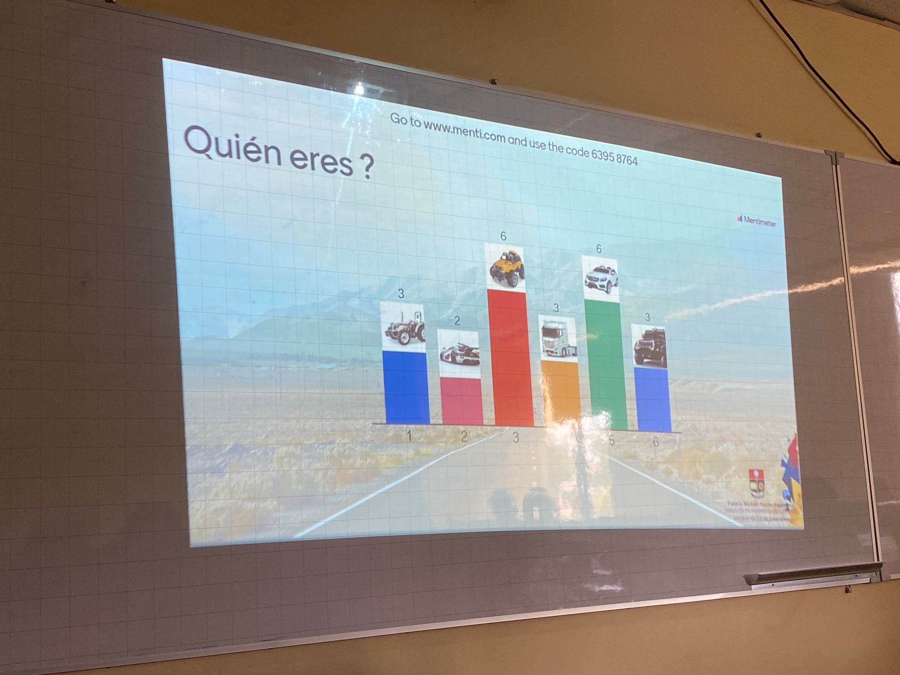
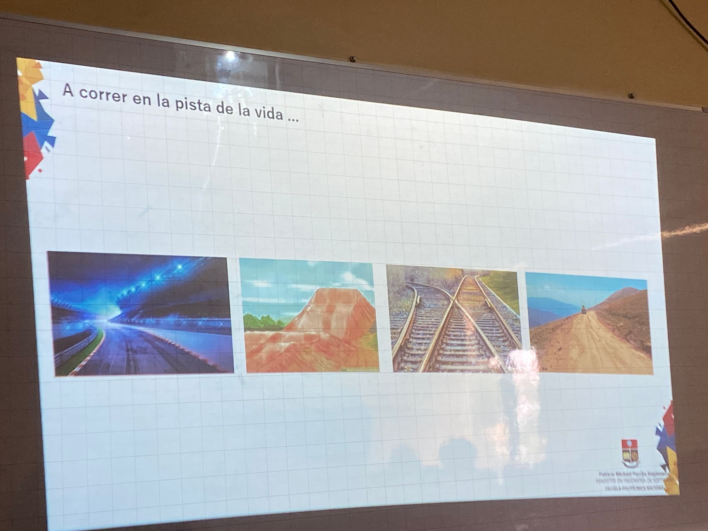
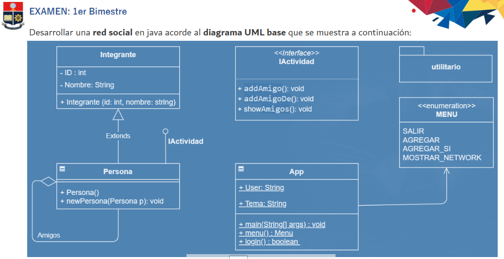

## Actividad en clase

**Fecha: 17-01-2023**

# Feedback
La actividad consistía en escoger el carro con el que nos identificamos.





# Interfaz

- Es el comportamiento de clases.
- Dar y obligar a las clases de adoptar un comportamiento
- << interface >> tiene que ir dentro de la clase persona.
- Las clases siempre empiezan en mayúsculas.

**Documentado**
```java
/* 
*  @ Author 
*  @ Date
*  @ Motivo o too do
*
*
*/
```
- El nombre de las variables en UML, deben ser las mismas que utilice en el código.
