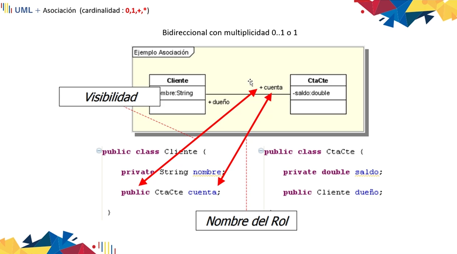
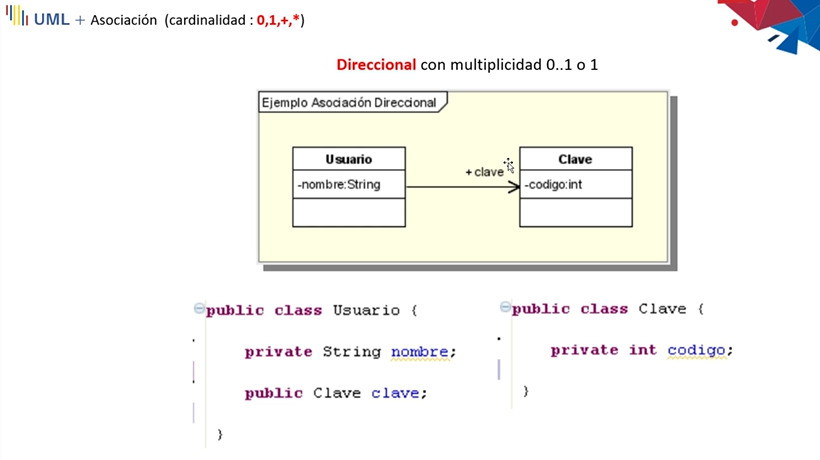
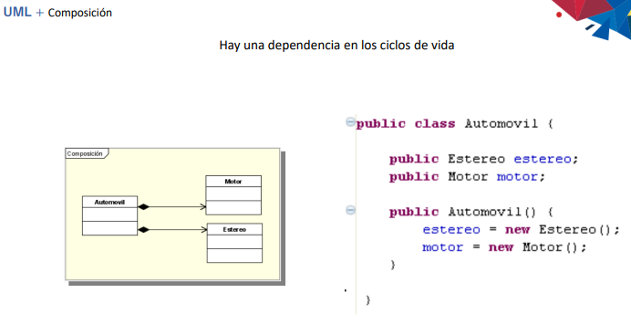
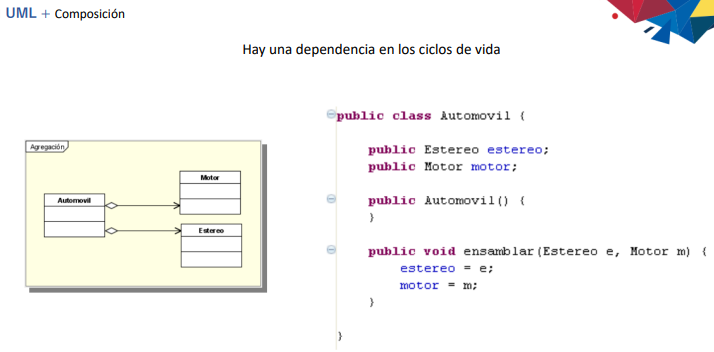
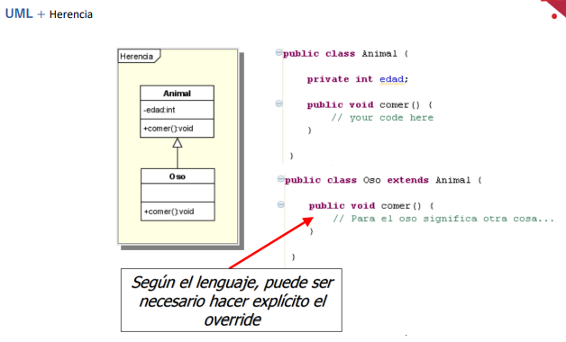
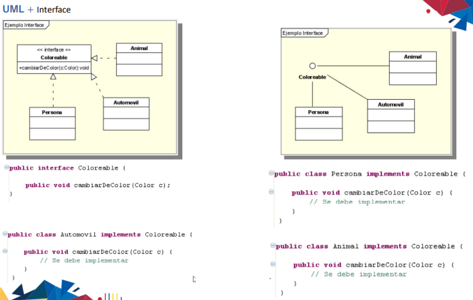
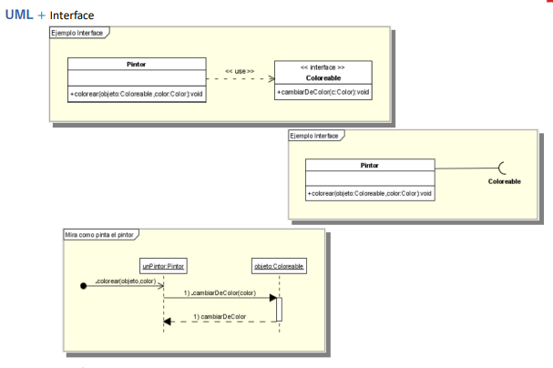
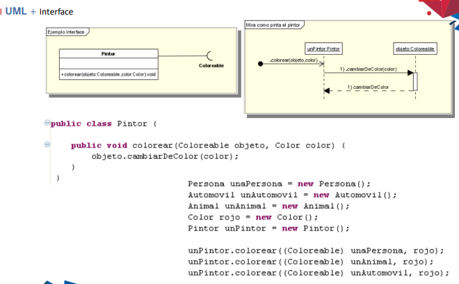
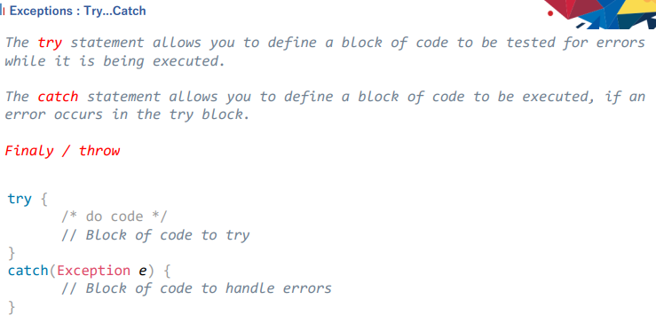

# Agregar librerías al código, Implantación de Herencias y programas inmortales (control de excepciones)

**Fecha: 18-01-2023**

1. Agregar librerías al código: Agregar .* jar
2. Implementación de herencias 
3. Control de excepciones (programas inmortales)

### Agregar librerías

**(.jar)--> Librería**
- Revisar: JFrame - JPanel - JLabel
- Reference libraries → Se pulsa “+” → Selecciono la carpeta que deseo

### Implementación de herencia

- public con “+”
- private con “-”
- protect con “#”

# UML + Asociación

## Direccional
+ Con dirección

- **Flecha:** solo el usuario puede tener algo

## Bidireccional con multiplicidad
+ **Con asterisco:** Cuantos existen(esta persona tiene muchas mascotas perros)

+ Cuando hay asteriscos se deben implementar listas

# UML + Composición

# UML + Herencia

# UML + Interface

0..* --> Significa que voy desde cero jugadores hasta muchos. Además significa que debo poner un constructor y al menos tener un jugador.
1..* --> Significa que yo debo poner el constructor

+ --> Significa uno o muchos

+ composición --> es obligatoria, siempre debe existir un contructor para construir mi objeto. Rombo con relleno.

+ asociación: rombo sin relleno

# Try and Catch - Control de errores

Try: controla para que la línea no se cuelgue

+ Una vez el try encuentra el error, el programa deja de ejecutar las líneas posteriores. Es como si las líneas que están por debajo del error no existieran.
+ **Finally:** Ejecuta si o si las líneas de código, sin importar si esta con errores o no.
+ **Catch:** Se coloca la alternativa al error de lo que se coloca en el **Try**.
+ El “burbujeo” es para presentar una pantallita al usuario final
+ **trow:** Permite sacar de lo profundo hasta la pantalla de usuario.

