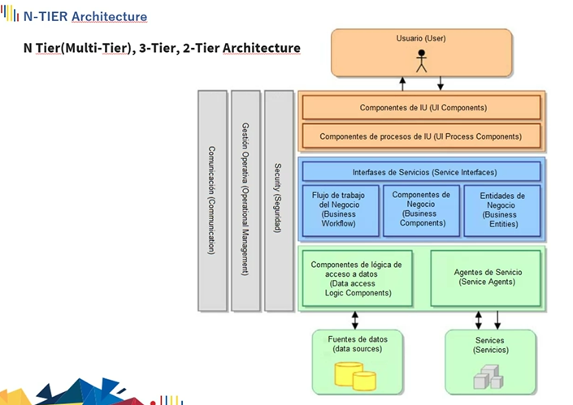

# ** N-TIER Architectura (Padre-Hijo) **

**Fecha: 04-01-2023**

+ ***Capas tomates***: Presentación.
+ ***Capas azules***: Entienden objetos de la aplicación.
+ ***Capas de persistencia(color verde)***: Almacenar información(datos).
+ ***Capas verticales(color gris)***: Capas de seguridad, no importa el lugar en el que se encuentren, deben tener seguridad.

+ ***Lógicas de negocio***: Procesos que se deben dar
+ ***Persistencia***: Se encarga del almacenado
+ Las acciones las puedo empequetar en interfaces

> ## ** Resumen (Padre-Hijo) **

+ Organizar y crear capas de forma ordenada
+ Todo queda empaquetado en un solo ejecutable.
+ Se lo monta en un servidor.
+ Se deve de tener en capas para saber manejarlo mejor y poder usarlo en servidores.
