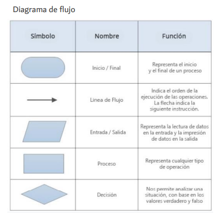
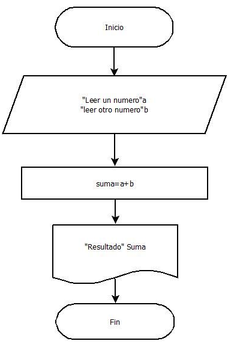
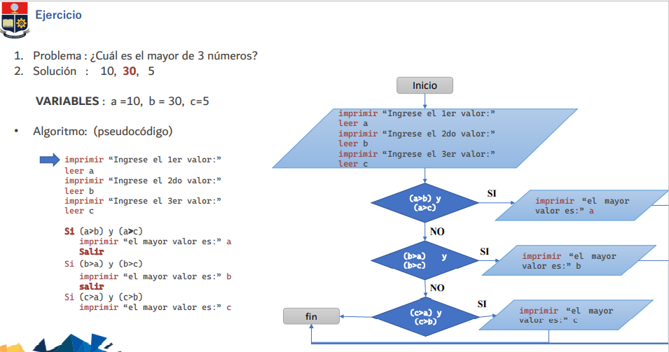

# **Diagrama de flujo**
+ Un diagrama de flujo, también llamado Flujograma de Procesos o Diagrama de Procesos, representa la secuencia o los pasos lógicos (ordenados) para realizar una tarea mediante unos símbolos.
+ Dentro de los símbolos se escriben los pasos a seguir.
+ Representan la secuencia lógica o los pasos que tenemos que dar para realizar una tarea mediante unos símbolos y dentro de ellos se describen los pasos ha realizar.
+ Debe proporcionar una información clara, ordenada y concisa de todos los pasos a seguir.

> ## **Simbología**

> ## **Ejemplo**

> ## **Ejercicio**

+ **Para más información ingresar al siguiente link:**

[diagrama_de_flujo](https://www.areatecnologia.com/diagramas-de-flujo.htm)

