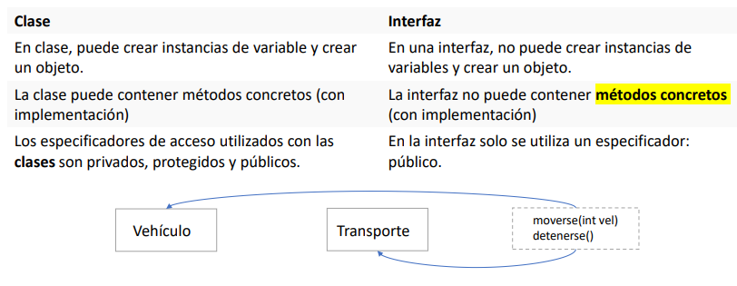
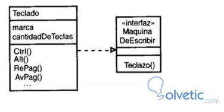
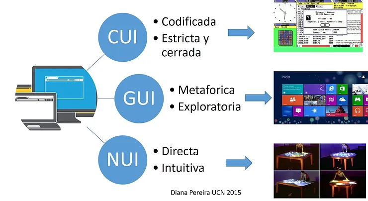
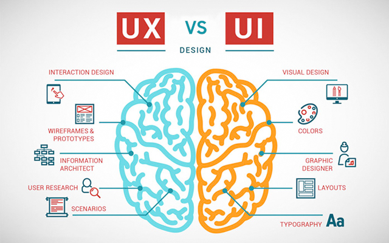

# ** Interfaz-Fachada **

**Fecha: 03/01/2023**

+ Permite especificar un conjunto de operaciones en clase que pueden ser utilizada por otras.
+ Es el acoplamiento que se le da al código.
+ Se acopla a una clase (implementa).
  + == (similar)
  + interfaz == Acción == Operación
+ Las interfaces solo declaran las operaciones(acciones) pero no la manera en que las van a hacer.
+ Obliga a la clase a hacer una acción.

### ** Ejemplo de interfaz **

---

> ## ** Tipos de interfaces **

+ ***Interfaz de linea de comandos(CUI):*** Interfaces alfanuméricas(intérpretes de comandos) que solo presentan texto.
+ ***Interfaces gráficas de usuario(GUI):*** Permiten comunicarse con la computadora de forma rápida e intuitiva representando gráficamente los elementos de control y medida.
+ ***Interfaz natural de usuario(NUI):*** Pueden ser táctiles(teléfonos o tablets), pueden funcionar mediante reconocimiento del habla(Siri o Alexa) o mediante movimientos corporales(kinect o Wii).
+ ***Interfaz física o hardware:*** teclados, ratones, pantallas, pulsadores, sensores, etc.
+ ***Interfaz lógica o software:*** Porgramas o parte de programa que permiten expresar las órdenes de una computadora o visualizar su respuesta.

---

> ## ** UX Y Usabilidad **

+ Atractivo para el usuario

+ get --> obtener informacion
+ set --> dar informacion

