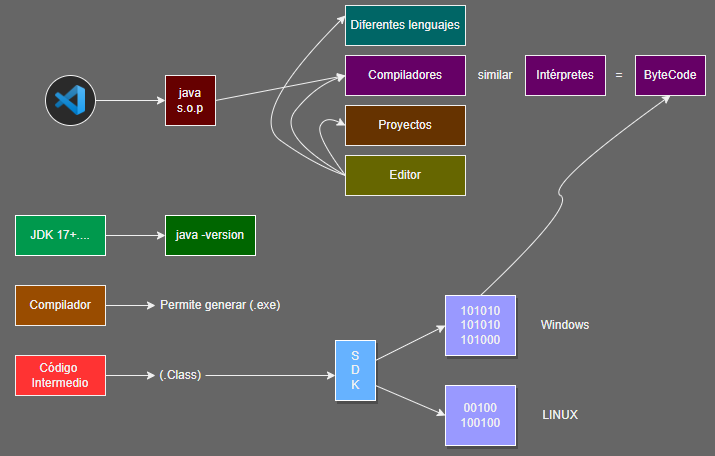
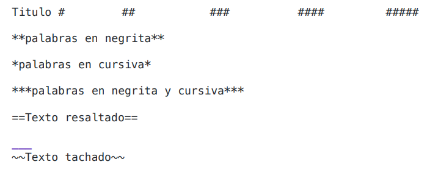
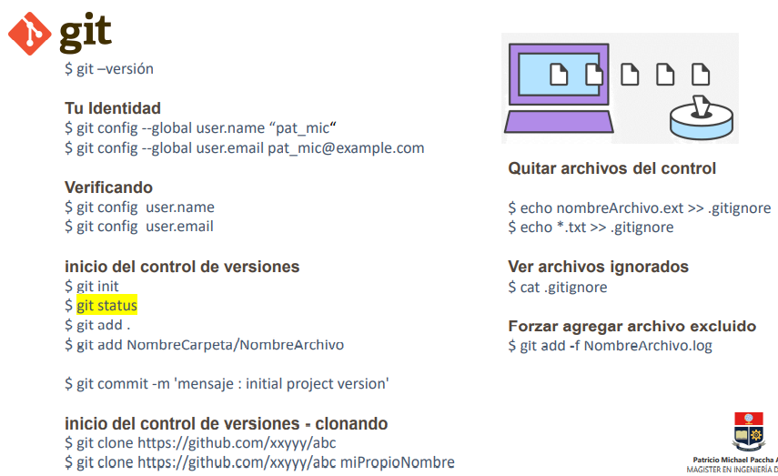

# Introducción

Fecha: 16/11/2022

> ## ¿Qué es un IDE?
Sus siglas signifan "Entorno de desarrollo integrado". Brinda las características para el trabajo del programador

> ## Markdown
Es un lenguaje de marcado con el que se puede agregar formato a documentos de texto plano. Fue creado por John Gruber en el año 2004, siendo a día de hoy uno de los lenguajes de marcado más famosos.

+ Se utiliza la extensión **.md**

> ## GIT
Git fue creado en 2005 por Linus Torvalds (creador de Linux) como herramienta para facilitar el desarrollo colaborativo de software. Desde entonces han surgido populares plataformas, como GitHub o GitLab, que permiten su uso online.

