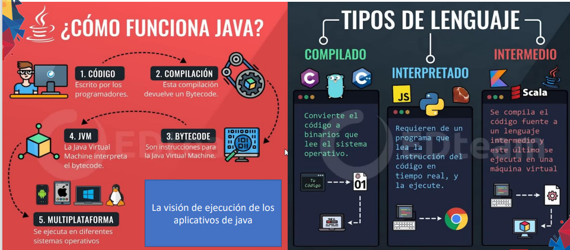

# ** Introducción **

**Fecha: 16/11/2022**

> ## ** ¿Qué es un IDE? **
Sus siglas signifan "Entorno de desarrollo integrado". Brinda las características para el trabajo del programador

> ## ** Markdown **

Es un lenguaje de marcado con el que se puede agregar formato a documentos de texto plano. Fue creado por John Gruber en el año 2004, siendo a día de hoy uno de los lenguajes de marcado más famosos.

+ Se utiliza la extensión **.md**

> ## ** GIT **
Git fue creado en 2005 por Linus Torvalds (creador de Linux) como herramienta para facilitar el desarrollo colaborativo de software. Desde entonces han surgido populares plataformas, como GitHub o GitLab, que permiten su uso online.

> ## ** Java **

Java es un lenguaje de programación y una plataforma informática que fue comercializada por primera vez en 1995 por Sun Microsystems.
El lenguaje de programación Java fue desarrollado originalmente por James Gosling, de Sun Microsystems,y publicado en 1995 como un componente fundamental de la plataforma Java de Sun Microsystems. Su sintaxis deriva en gran medida de C y C++, pero tiene menos utilidades de bajo nivel que cualquiera de ellos. Las aplicaciones de Java son compiladas a bytecode (clase Java), que puede ejecutarse en cualquier máquina virtual Java (JVM) sin importar la arquitectura de la computadora subyacente.

