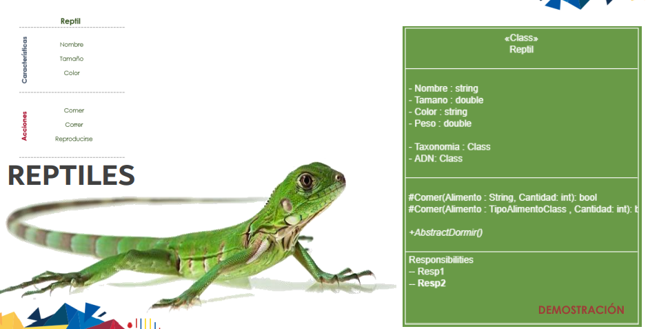
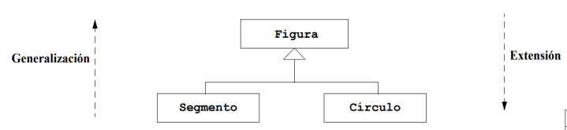
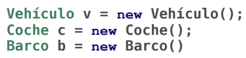

# **Programación Orientada a Objetos**

**Fecha: 14/12/2022**

> ## **Métodos**

Ámbitos:

+ (+) --> público
+ (-) --> privado
+ (~) --> protegido

> ## **Clases**

|   Class            |
|--------------------|
|Propiedades         |
|   Métodos          |
|  Responsabilidades | 

**Ejemplo gráfico**

> ## **Relación de herencia**

+ Es la relación que existe entre clases (dependencia).
+ La herencia es un mecanismo por el que se pueden crear nuevas clases a partir de otras existentes.
+ Nomenclatura:

  |clase original | superclase | padre | vehículo |
  |---------------|------------|-------|----------|
  |clase extendida| subclase   | hijo  | coche    |

+ La herencia también se denomina ***Extensión*** o ***Generalización***.

+ Al extender una clase 
  + Se heredan toda las operaciones del padre.
  + Se puede añadir nuevas operaciones.
+ La subclase puede elegir para las operaciones heredadas.
  + redefinir la operación, se vuelve a escribir.
+ La herencia puede aplicarse en sucesivos niveles, creando grandes jerarquías de clases.

---

> ## **Ventajas y desventajas del uso de la herencia**

 | Ventajas                                | Desventajas             |
 |-----------------------------------------|-------------------------|
 |Mejora el diseño                         | Aumenta el acoplamiento |
 |Permite la reutilización de código       |                         |
 |Facilita la extensión de las apps        |                         |

---

+ “extends” en JAVA es equivalente a “:”  en C.   Que significa que un clase se esta heredando de otra. 
   + ej. coche extends vehiculo
+ La palabra ***“new”*** me indica que es un objeto.
+ << v >>  es la referencia al objeto. 

   

+ Puedo tener espacios de referencia sin memoria.
+ ***gc.star();*** --> Recolector de basura

> ## **Constructores**

+ Cuando pongo ***new*** se va a llamar al constructor de la clase.
+ Las constructores no se heredan.
+ Un constructor se ejecuta una sola vez.
+ Cada clase va a tener su constructor.
+ Construye en la RAM el lugar de memoria  donde va a reposar el objeto.
+ Los que yo defina en el ***main {}*** son los que van a estar participando en la RAM.
+ El ***main*** no es un constructor.
+ TODAS las clases tienen constructores.
+ **Secreto de la POO:** No puedo evitar que el constructor del padre se me ejecute, sin embargo puedo jugar con que constructores ejecutar.
+ El constructor sin parámetros es el constructor por defecto.
+ La llamada a ***"super"*** debe ser la primera instrucción del constructor de la subclase.
+ Con la palabra restringida << super >> se puede llamar al constructor que se desea a partir del hijo. 
+ Como hijo puedo condicionar con que constructor crearme. 
+ Una buena practica es que dentro de la clase se use << this.>> para referirme a mis propiedades.
+ ***@Override*** me permite sobrescribir el código de una clase padre y hacer que se ejecuten las nuevas líneas que escribí.
+ En cualquier clase todos los métodos deben ser privados.