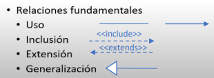

# Modelado O.O - UML

---
Fecha: 20/12/2022

+ ***UML*** --> permite modelar todos los estilos de negocio o acoplandose con un giro de negocio que ya existe.

Link para más información acerca de ***UML***:

[infoUML](https://www.lucidchart.com/pages/es/que-es-el-lenguaje-unificado-de-modelado-uml)

---

## Casos de uso

+ Equivalente a describir un escenario.
+ Se utilizan tres simbologías: 

   [x] ***actor*** --> Es aquel que puede incidir una cadena de eventos (por lo general es el usuario, cliente, contribuyente, etc).

   [x] ***flecha*** --> Me dice cual es el sentido hacia donde se va a generar el flujo o evento.

   [x] ***elipse(caso de uso)*** --> Es lo que voy a desglosar.

   

+ Un actor también puede ser el sistema.
+ ***Requerimientos funcionales*** --> Son los requerimientos del usuario.
+ ***Relaciones*** --> Como el actor interactúa con el caso de uso o entre actores.
   + ***inclusión*** --> Sirve para incorporar explícitamente el comportamiento de otro caso de uso, un caso de uso utiliza información y servicios de otro, es obligatorio.
   + ***extensión*** --> Sirve para conoceer que cosas le acompañañ a algo, es opcional.
   + ***generalización*** --> Se utiliza para hacer clasificaciones.

  
