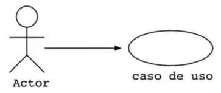
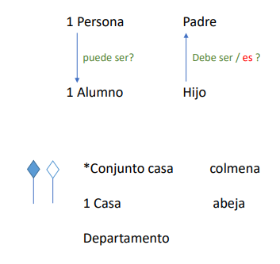

# **Modelado O.O - UML**

**Fecha: 20/12/2022**

+ ***UML*** --> permite modelar todos los estilos de negocio o acoplandose con un giro de negocio que ya existe.
+ ***Modelado***: Permite pasar de un nivel dveloper a un nivel architect

Link para más información acerca de ***UML***:

[infoUML](https://www.lucidchart.com/pages/es/que-es-el-lenguaje-unificado-de-modelado-uml)

---

> ## **Casos de uso**

+ Equivalente a describir un escenario.
+ Se utilizan tres simbologías: 

   [x] ***actor*** --> Es aquel que puede incidir una cadena de eventos (por lo general es el usuario, cliente, contribuyente, etc).

   [x] ***flecha*** --> Me dice cual es el sentido hacia donde se va a generar el flujo o evento.

   [x] ***elipse(caso de uso)*** --> Es lo que voy a desglosar, las acciones empiezan con un verbo en infinitivo: ar, er, ir.

   

+ Un actor también puede ser el sistema.
+ ***Requerimientos funcionales*** --> Son los requerimientos del usuario.
+ ***Relaciones*** --> Como el actor interactúa con el caso de uso o entre actores.
   + ***inclusión*** --> Sirve para incorporar explícitamente el comportamiento de otro caso de uso, un caso de uso utiliza información y servicios de otro, es ***obligatorio***.
   + ***extensión*** --> Sirve para conoceer que cosas le acompañañ a algo, es ***opcional***.
   + ***generalización*** --> Se utiliza para hacer clasificaciones.

  

+ ***Cardinalidad***: Son de cuantos de elementos se componen un cierto objeto
+ ***Dos felchas*** --> Significa composición
  + La que lleva el color es ***obligatorio***
  
   

---
> ## **Notas**

+ Los objetos no se duplican.
+ El constructor se ejecuta una única vez.
+ No crear cosas que no se necesitan porque me pueden generar un bug.
+ Si la flecha va hacia arriba es generalizacion, y si va para abajo es especificación.

